# 🛍️ EcommerceApp

**EcommerceApp** is a modern Kotlin-based Android e-commerce application that allows users to browse, search, and interact with products in a smooth, responsive interface. Built using MVVM, Clean Architecture, Kotlin Coroutines, and Firebase for real-time functionality.

---

## 📱 Key Screens & Features

* **Start Page** – App entry with logo and choice between Sign In or Sign Up
* **Sign In / Sign Up Page** – Register or login via Email (Google/Facebook not used)
* **Home Page** – Browse product slider (ViewPager) and featured items
* **Search Page** – Search for products
* **Search Result Page** – View filtered product results
* **Detail Page** – View product details with:

  * Select size and color
  * Choose quantity
  * Contact product owner via chat
  * Add to cart or favorites
* **Chat Page** – Message with the product owner
* **Cart Page** – View items in your shopping cart
* **Profile Page** – View user profile and activity
* **Edit Profile Page** – Update avatar, name, and other user details
* **Settings Page** – Configure preferences
* **Language Page** – Change application language (i18n)
* **Favorite Page** – Access your liked/favorited products

---

## 📸 Screenshots

| Start Page | Log In | Sign Up | Home Page |
|------------|---------|---------|-----------|
| 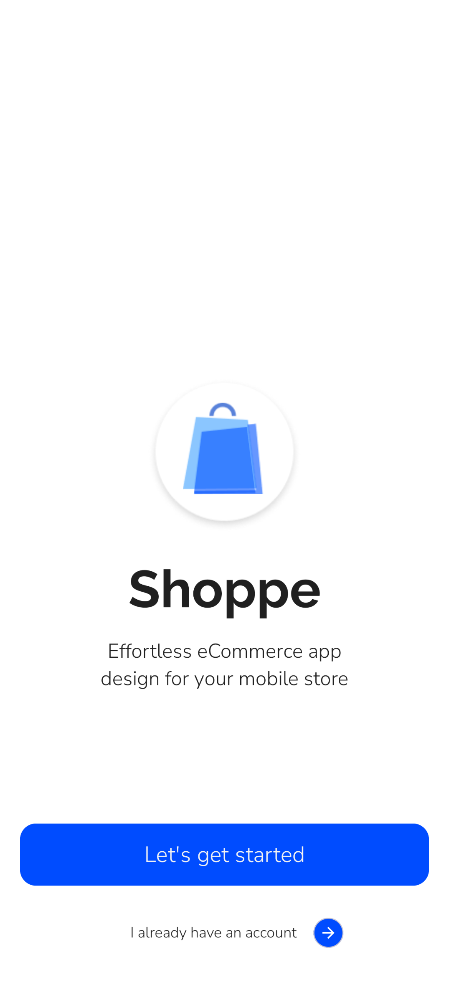 | 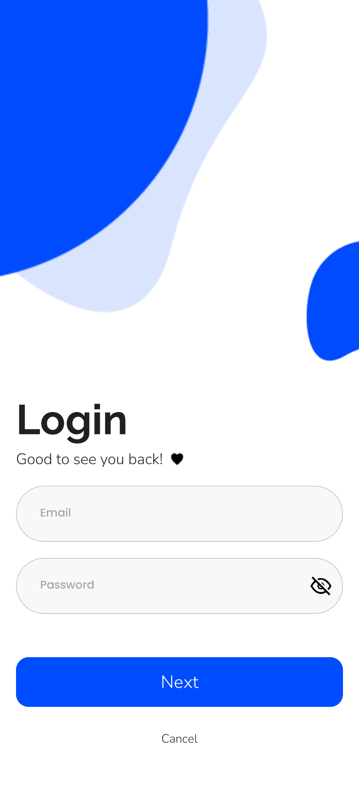 | 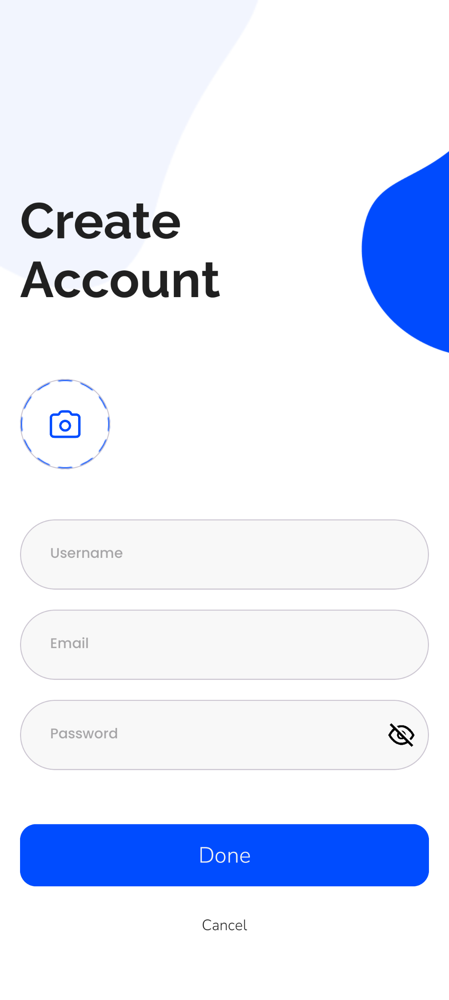 | 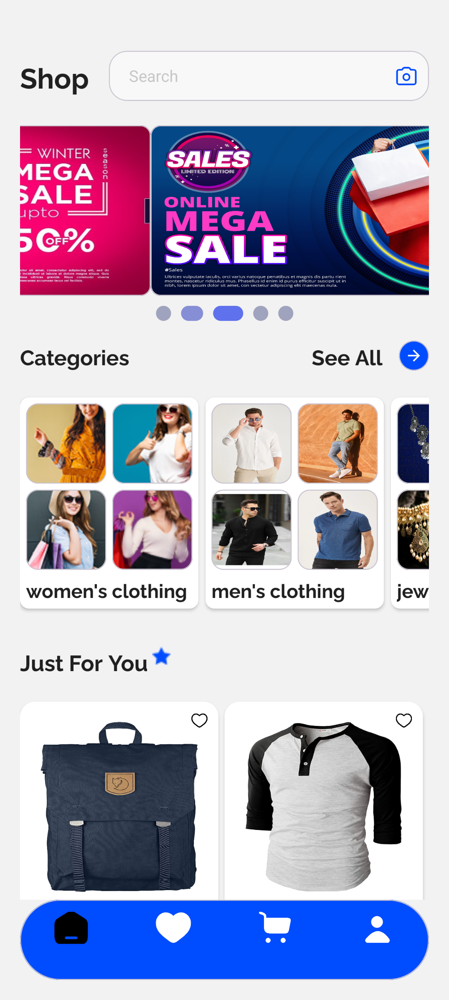 |

| Product Detail | Add Image | Chat Page | Search Page |
|----------------|-------------|------------|--------------|
| 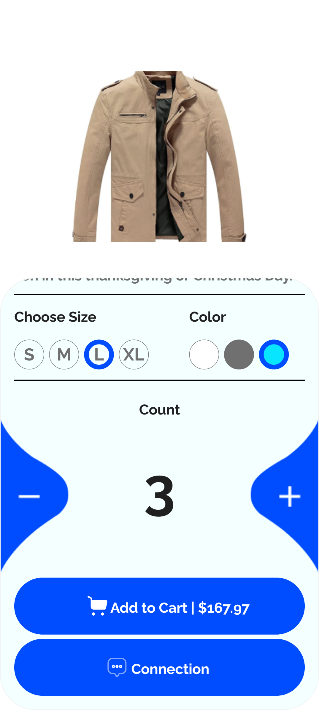 | 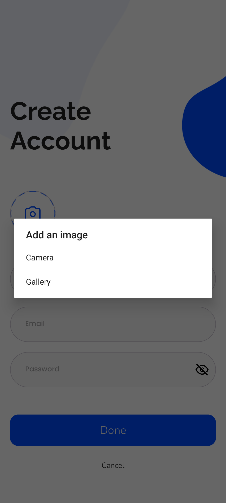 | 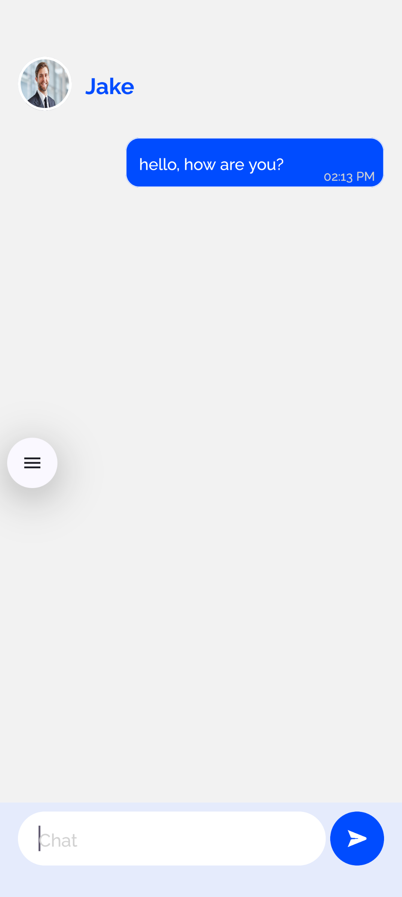 | 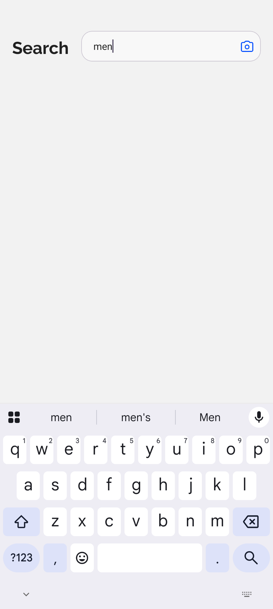 |

| Search Result | Cart Page | Favorite Page | Settings Page |
|----------------|------------|----------------|----------------|
| 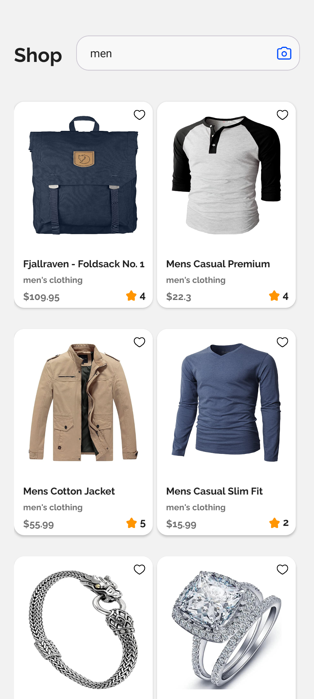 | 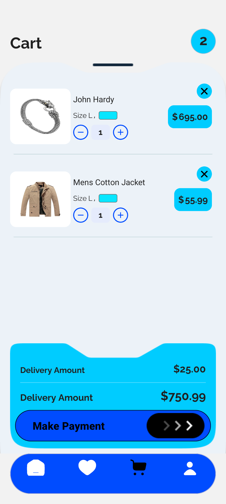 | 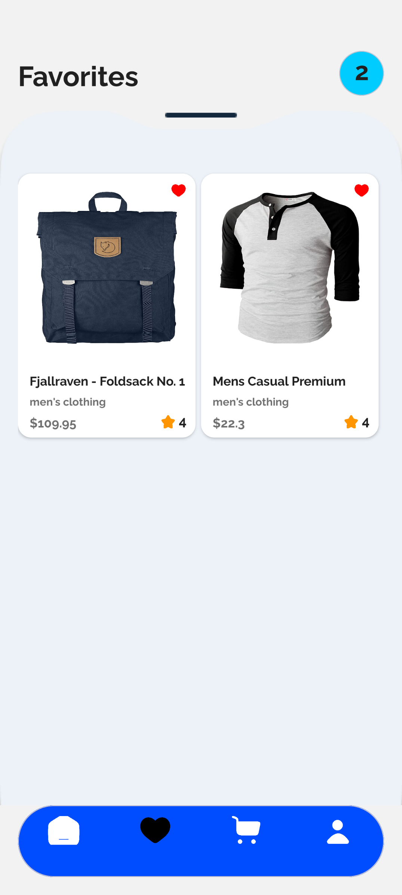 | 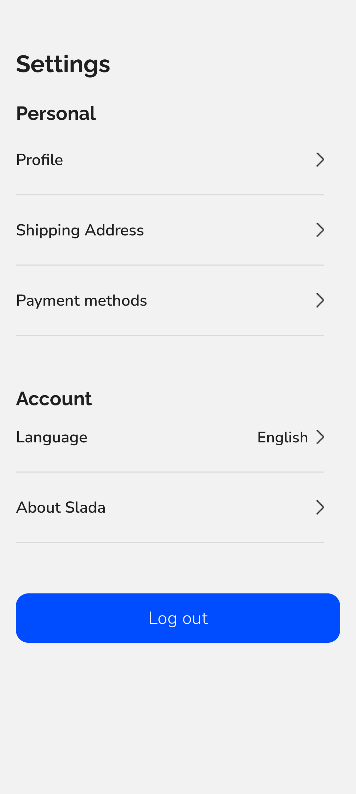 |

| Profile Page | Edit Profile | Language Page |
|----------------|---------------|-----------------|
| 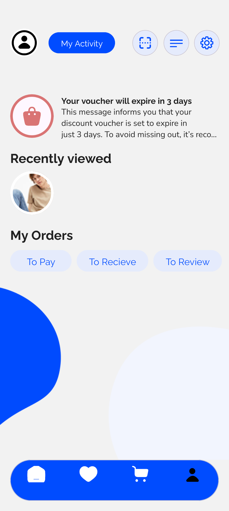 | 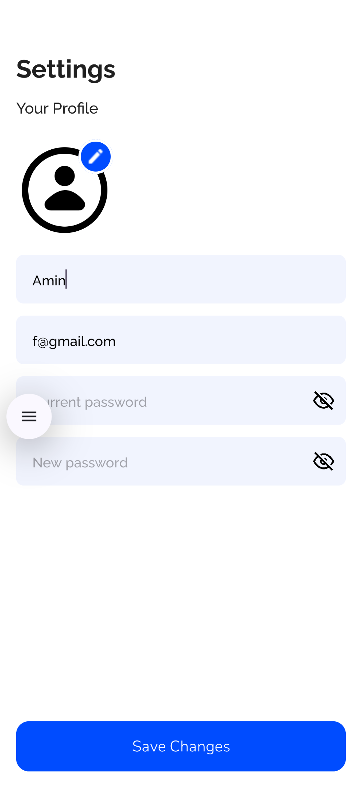 | 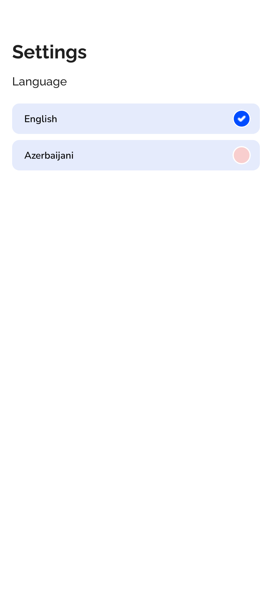 |


---

## 🧠 Technologies Used

| Technology               | Purpose                                |
| ------------------------ | -------------------------------------- |
| **Kotlin**               | Core programming language              |
| **Kotlin Coroutines**    | Asynchronous operations, concurrency   |
| **MVVM**                 | Architecture pattern                   |
| **Clean Architecture**   | Layer separation (UI, Domain, Data)    |
| **SOLID Principles**     | Scalable and maintainable codebase     |
| **Material Design 3**    | UI and design system                   |
| **Firebase Auth**        | Email-based login                      |
| **Firebase Firestore**   | Real-time DB for product data and chat |
| **Firebase Storage**     | Upload and retrieve product images     |
| **Room**                 | Local database (e.g., favorites, cart) |
| **Retrofit**             | Network layer with coroutine support   |
| **Hilt**                 | Dependency injection                   |
| **LiveData / StateFlow** | Reactive state management              |
| **SharedPreferences**    | Save settings (theme, language, login) |
| **Navigation Component** | Fragment navigation and backstack      |

---

## ⚙️ Core Features

* ✅ Register and login with Email (no Google/Facebook)
* ✅ Browse product list, slider, and search results
* ✅ Add to cart, choose product details (color, size, quantity)
* ✅ Chat with product owner
* ✅ Like or favorite products
* ✅ Dark/light mode toggle
* ✅ Offline support with Room DB
* ✅ Language switching (internationalization)
* ✅ Upload profile images
* ✅ Edit profile and preferences

---

## 🧱 Project Architecture

### 🧩 Clean Architecture (with Kotlin Coroutines)

#### 1. **UI Layer**

* Fragments and ViewModels
* Uses `StateFlow` & `LiveData` for reactive UI
* UI ↔ Domain mappers

#### 2. **Domain Layer**

* Use Cases contain business logic
* Pure Kotlin classes
* Suspend functions used for coroutines

#### 3. **Data Layer**

* Repositories for Firebase, Room, Retrofit
* Suspend functions for all data operations
* Coroutine support for asynchronous I/O
* Mappers between data ↔ domain models

---

## 🔁 Coroutine Flow

* Firestore with `callbackFlow` to emit live `Flow<Result<T>>`
* Room DAO uses suspend & Flow for local data
* Retrofit uses suspend network calls
* UseCases handle coroutine logic
* ViewModels collect and expose via `StateFlow`

---

## 🚀 Getting Started

1. Clone the repository:

```bash
git clone https://github.com/AminAbbasov778/EcommerceApp.git
```

2. Open in Android Studio and build the project.
3. Configure your Firebase project and add `google-services.json`.
4. Run the app on emulator or physical device.

---

## 📬 Contact

For any inquiries or collaboration:
**Amin Abbasov** – [amin.abbasov778@gmail.com](mailto:amin.abbasov778@gmail.com)

---


